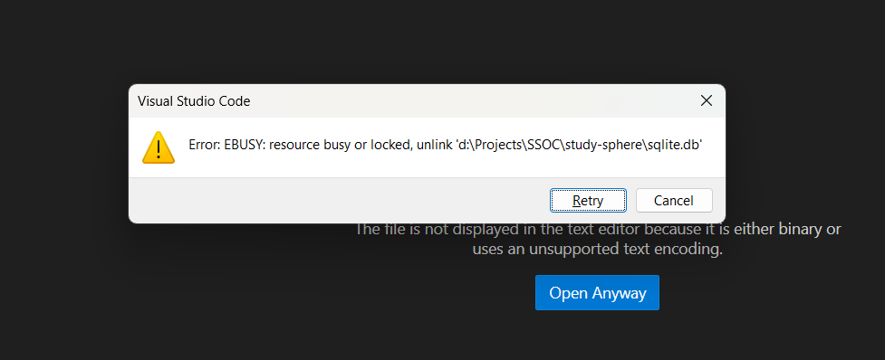

# Development Guide for Study Sphere

Welcome to the development guide for **Study Sphere** — your all-in-one platform for studying smarter with notes, quizzes, and AI assistance.

---

## Project Setup

### Prerequisites

* **Bun** (JavaScript runtime) - [Install Bun](https://bun.sh/docs/installation)
* **Node.js** (Fallback)
* **Git**

### 1. Clone the Repository

```bash
git clone https://github.com/k0msenapati/study-sphere.git
cd study-sphere
```

### 2. Install Dependencies

```bash
bun install
```

### 3. Set Up Environment Variables

Create a `.env.local` file in the root directory:

```env
GROQ_API_KEY=your_key_here
```

### 4. Set Up SQLITE Database

#### Create sqlite.db file
Go to terminal and run this command:

```bash
npx drizzle-kit push
```

This will create a file `sqlite.db` in the root directory of the project.

⚠️ **Warning:** Opening `sqlite.db` file and making changes manually is not recommended, as the sqlite.db file is stored in binary format.
If you make changes, you can delete that file and run:

```bash
npx drizzle-kit push
```

This will again create a new and blank `sqlite.db` file, and you can do your contribution work

#### Delete sqlite.db file
When trying to delete the `sqlite.db` file, you may get this error:



This happens when you try to delete the `sqlite.db` file when it is being used by either the next js app or the drizzle studio.

Solution:
- Stop the work which is using the `sqlite.db` file
- Then delete the file

### 5. Run the Development Server

```bash
bun run dev
```

Then open [http://localhost:3000](http://localhost:3000) in your browser.

---

## Demo Video

- Here is a demo video showing how to set up and run the project:
<a href="https://www.youtube.com/watch?v=fHgIxKXQMN4" target="_blank">
  
</a>

## Project Structure

```
study-sphere/
├── public/
├── src/
│   ├── app/              # Next.js pages & routing
│   ├── components/       # UI components
│   ├── lib/              # Utility libraries
├── .env.local            # API Keys
├── next.config.mjs       # Next.js config
├── tsconfig.json         # TypeScript config
├── tailwind.config.ts    # Tailwind CSS config
└── biome.json            # Code formatting
```

---

## Testing & Linting

* **Biome** is used for formatting and linting.

```bash
bun run lint
bun run format
```

---

## Useful Scripts

| Script       | Description           |
| ------------ | --------------------- |
| `bun dev`    | Start dev server      |
| `bun build`  | Build for production  |
| `bun lint`   | Lint codebase (Biome) |
| `bun format` | Format code (Biome)   |

---

## Troubleshooting

* **Bun not working?** Try switching to Node.js + npm/yarn.
* **GROQ\_API\_KEY invalid?** Ensure your key is correct and has access to GROQ services.

---

Happy hacking! 🎉
