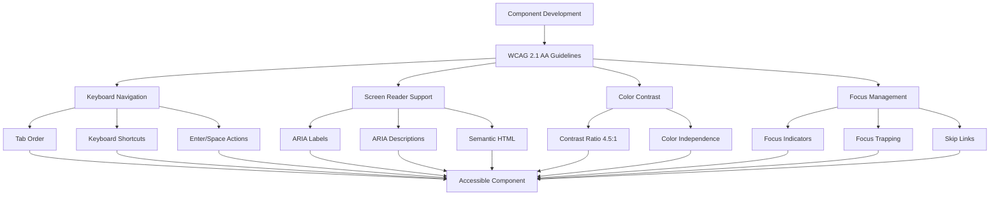
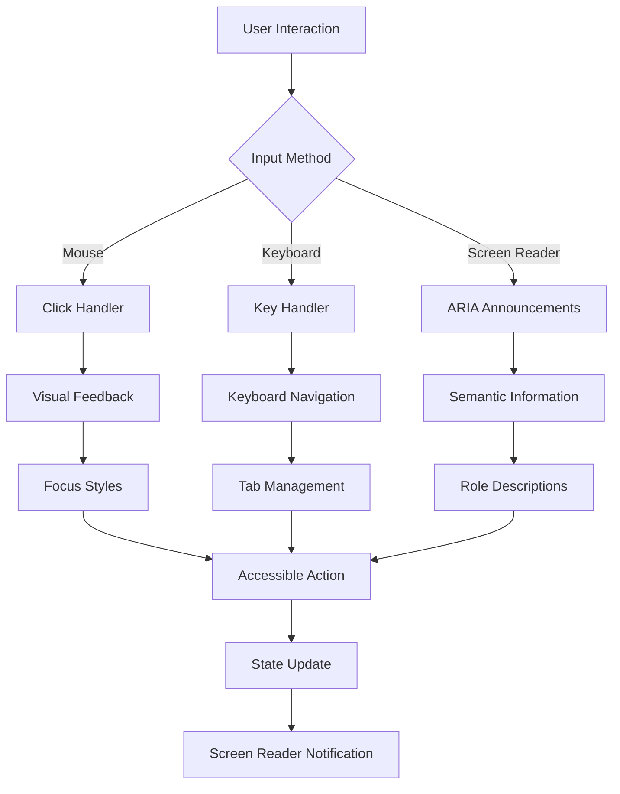
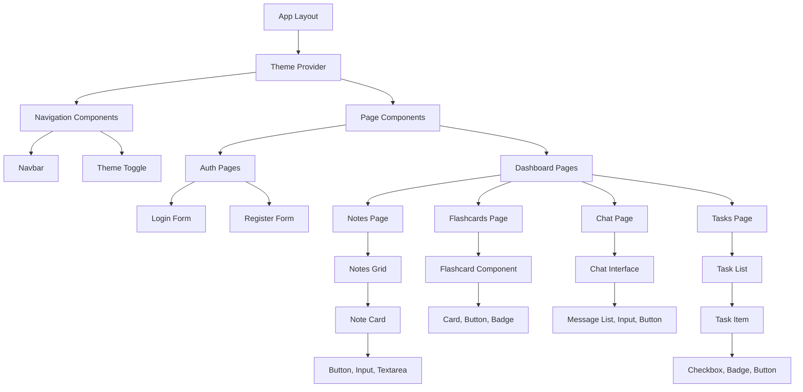
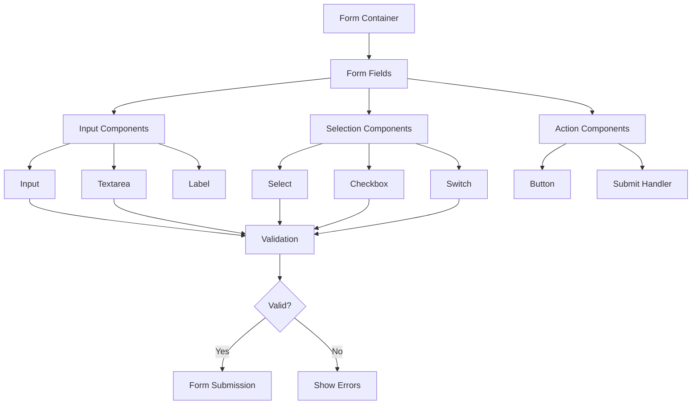
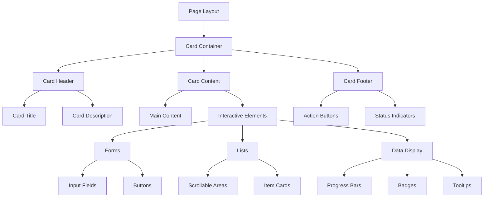
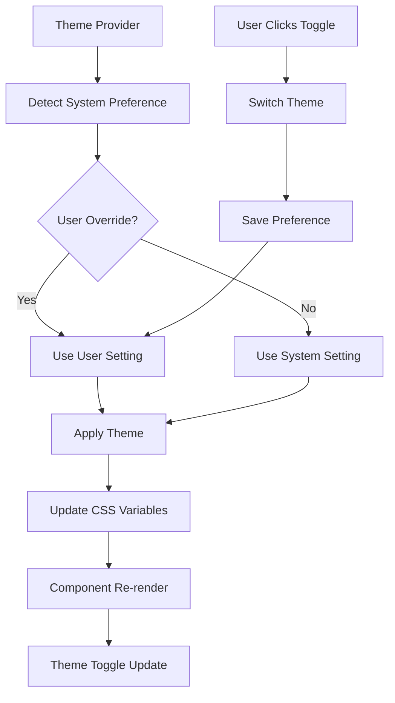
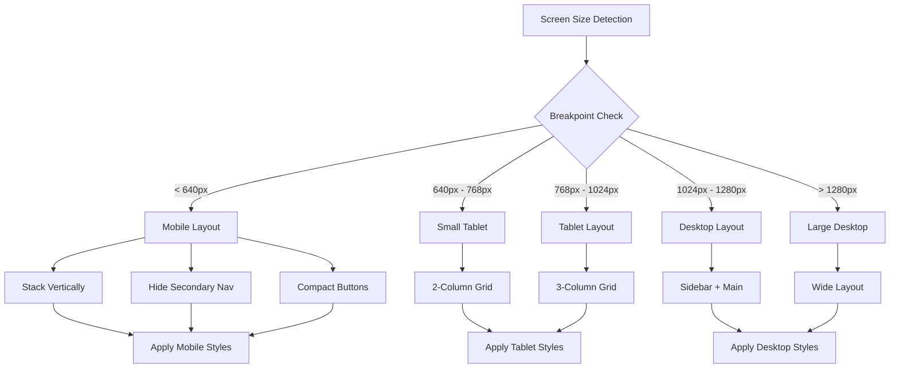

# UI Components

## 🎨 Design System

Study Sphere uses Tailwind CSS and Radix UI primitives for consistent, accessible components.

## 🏗️ Component Structure

```
src/components/ui/       # Base UI components
├── button.tsx          # Button variants
├── card.tsx           # Container components
├── dialog.tsx         # Modal dialogs
├── input.tsx          # Form inputs
├── textarea.tsx       # Text areas
├── select.tsx         # Dropdown selects
├── checkbox.tsx       # Checkboxes
├── switch.tsx         # Toggle switches
├── badge.tsx          # Status badges
├── progress.tsx       # Progress bars
├── flashcard.tsx      # Custom flashcard component
└── ...               # Other UI primitives
```

## 🎯 Design Tokens

### Colors
- **Primary**: Dark text and buttons
- **Secondary**: Light backgrounds
- **Muted**: Subtle backgrounds
- **Accent**: Highlighted elements
- **Destructive**: Error states

### Typography
- **Sans**: Geist Sans (primary font)
- **Mono**: Geist Mono (code font)

## 🧩 Key Components

### Button Component
```typescript
const buttonVariants = cva(
  "inline-flex items-center justify-center rounded-md text-sm font-medium",
  {
    variants: {
      variant: {
        default: "bg-primary text-primary-foreground hover:bg-primary/90",
        destructive: "bg-destructive text-destructive-foreground",
        outline: "border border-input hover:bg-accent",
        secondary: "bg-secondary text-secondary-foreground",
        ghost: "hover:bg-accent hover:text-accent-foreground",
        link: "text-primary underline-offset-4 hover:underline",
      },
      size: {
        default: "h-10 px-4 py-2",
        sm: "h-9 rounded-md px-3",
        lg: "h-11 rounded-md px-8",
        icon: "h-10 w-10",
      },
    },
  }
);
```

### Card Component
```typescript
const Card = React.forwardRef<
  HTMLDivElement,
  React.HTMLAttributes<HTMLDivElement>
>(({ className, ...props }, ref) => (
  <div
    ref={ref}
    className={cn(
      "rounded-lg border bg-card text-card-foreground shadow-sm",
      className
    )}
    {...props}
  />
));
```

## 🎨 Theme Support

### Dark/Light Mode
- System preference detection
- Manual theme switching
- Consistent color schemes
- Accessible contrast ratios

### CSS Variables
```css
:root {
  --background: 0 0% 100%;
  --foreground: 222.2 84% 4.9%;
  --card: 0 0% 100%;
  --card-foreground: 222.2 84% 4.9%;
  --primary: 222.2 47.4% 11.2%;
  --primary-foreground: 210 40% 98%;
}

.dark {
  --background: 222.2 84% 4.9%;
  --foreground: 210 40% 98%;
  --card: 222.2 84% 4.9%;
  --card-foreground: 210 40% 98%;
  --primary: 210 40% 98%;
  --primary-foreground: 222.2 47.4% 11.2%;
}
```

## ♿ Accessibility Features

### Accessibility Implementation Flow


### Component Accessibility Flow


## 📱 Responsive Design

- Mobile-first approach
- Breakpoint system:
  - `sm`: 640px
  - `md`: 768px
  - `lg`: 1024px
  - `xl`: 1280px
  - `2xl`: 1536px

## 🎯 Component Usage

### Component Hierarchy Flow


### Form Components Flow


### Layout Components Flow


### Theme System Flow


### Responsive Design Flow


### Form Example with Components
```tsx
<form>
  <Input placeholder="Enter text..." />
  <Textarea placeholder="Enter description..." />
  <Select>
    <SelectItem value="option1">Option 1</SelectItem>
  </Select>
  <Button type="submit">Submit</Button>
</form>
```

### Layout Example with Components
```tsx
<Card>
  <CardHeader>
    <CardTitle>Title</CardTitle>
  </CardHeader>
  <CardContent>
    Content goes here
  </CardContent>
</Card>
```

## 🔧 Configuration

Components are configured via `components.json`:
```json
{
  "style": "default",
  "rsc": true,
  "tsx": true,
  "tailwind": {
    "config": "tailwind.config.ts",
    "css": "src/app/globals.css",
    "baseColor": "slate",
    "cssVariables": true
  },
  "aliases": {
    "components": "@/components",
    "utils": "@/lib/utils"
  }
}
```