# Study Sphere Workflows

## 🔄 Overview

This document describes the actual user workflows and system processes in Study Sphere.

## 🔐 Authentication

### Registration Flow
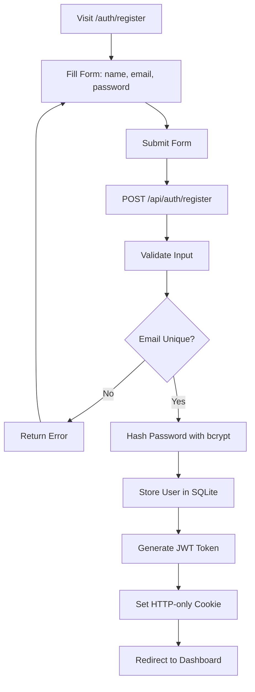

### Login Flow
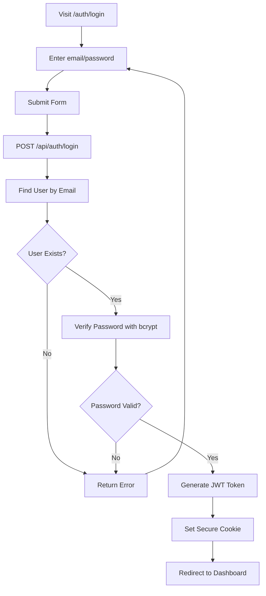

## 📝 Notes Workflow

### Creating Notes Flow
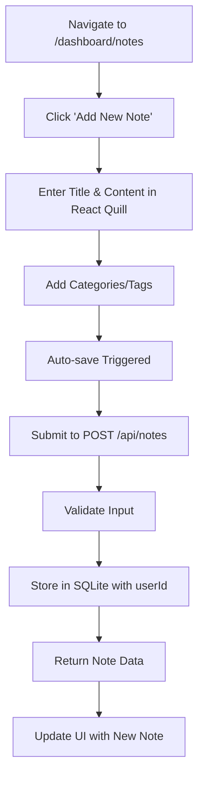

### Managing Notes Flow
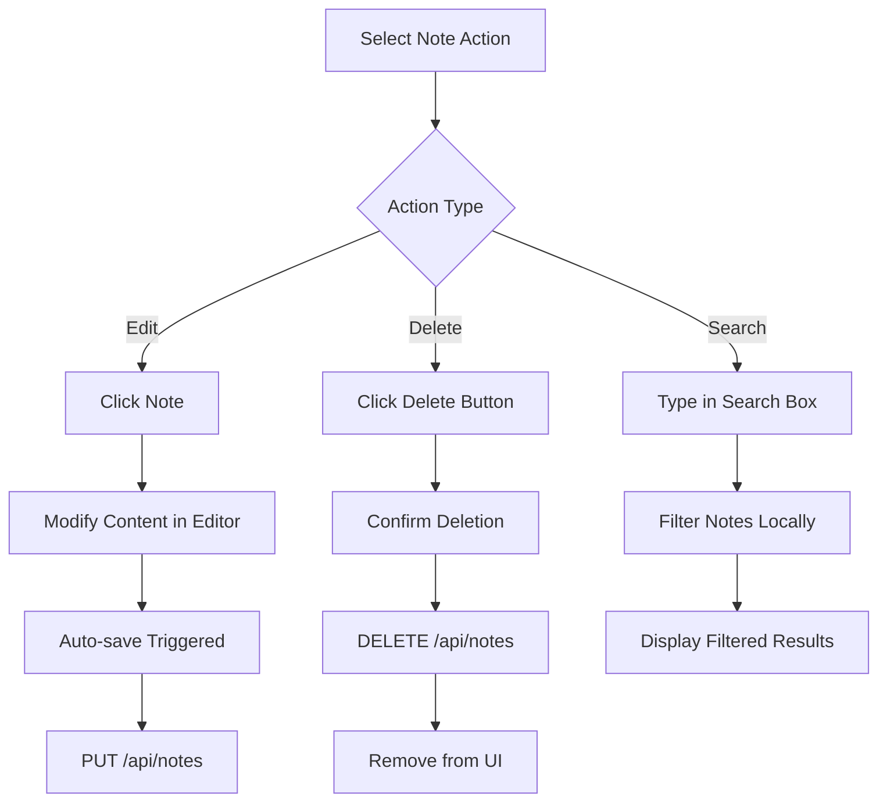

## 🃏 Flashcards Workflow

### Generating Flashcards Flow
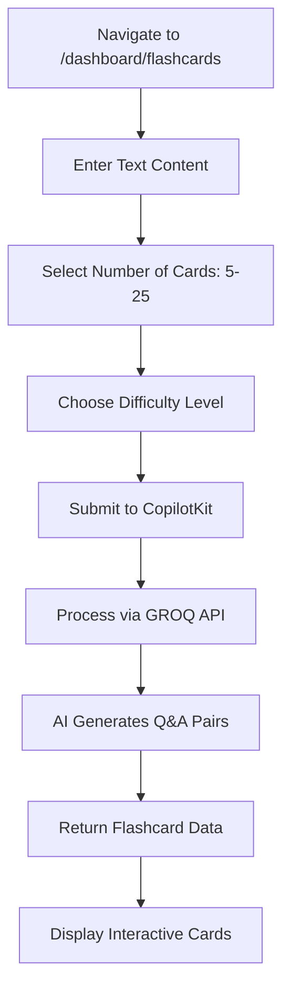

### Studying Flow
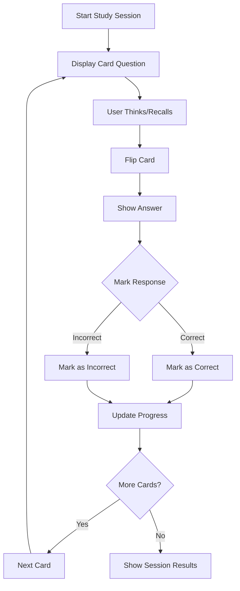

## ❓ Quiz System

### Taking Quizzes
1. Navigate to `/dashboard/quizzes`
2. Select quiz from collection
3. Start timer (5 minutes)
4. Answer multiple choice questions
5. Submit answers
6. Calculate score
7. Show results

## 🤖 Study Buddy Chat

### AI Conversation Flow
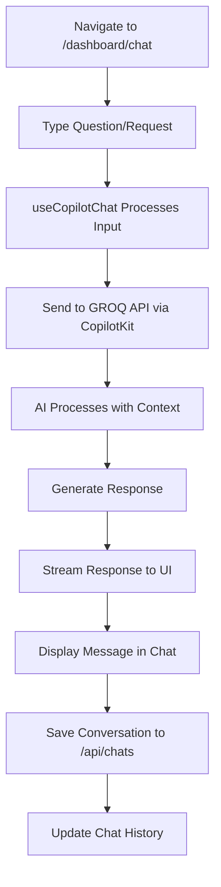

### Chat Context Flow
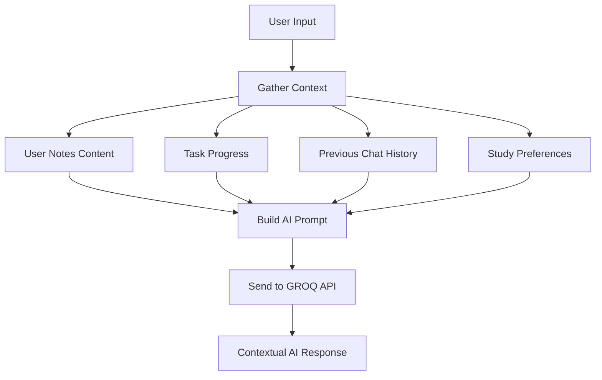

## 📋 Task Management

### Creating Tasks
1. Navigate to `/dashboard/todos`
2. Click "Add Task"
3. Enter title, description, priority, due date
4. Submit to POST `/api/tasks`
5. Store in SQLite

### Managing Tasks
- Update status (pending → in-progress → completed)
- Edit task details
- Delete tasks
- Filter by status/priority

## 📊 Daily Review

### Review Process
1. Navigate to daily review
2. Rate productivity (1-10 scale)
3. Add reflection notes
4. Submit to POST `/api/daily-reviews`
5. View progress over time

## ⚙️ Settings Management

### User Preferences
1. Navigate to settings
2. Configure study preferences:
   - Work hours (start/end time)
   - Break intervals
   - Focus session duration
   - Peak productivity hours
3. Save to PUT `/api/user-settings`

## 🔄 Data Flow

### Authentication Flow
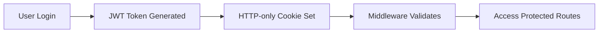

### API Communication Flow
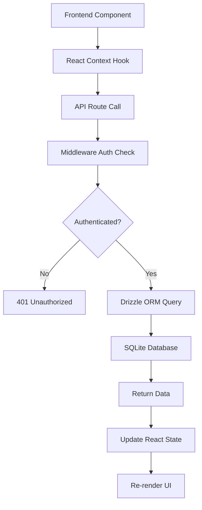

### AI Integration Flow
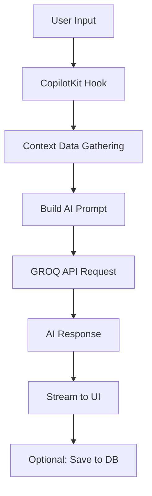

## 🚫 Limitations

- No WebSocket connections
- No real-time collaboration
- No cloud storage
- SQLite for development only
- Basic error handling
- Single-user focus